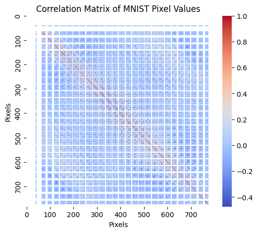
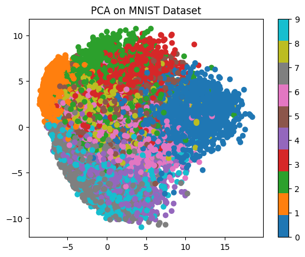
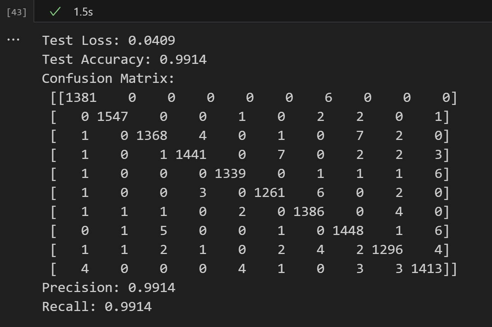

# Custom-CNN-ImageClassification

This project trains a Convolutional Neural Network (CNN) to classify images from the MNIST dataset. 

**Dataset** - [MNIST](https://archive.ics.uci.edu/dataset/683/mnist+database+of+handwritten+digits)

<p>
  Developed with the software and tools below.
</p>
<p>


</p>

## **Overview**

### <strong>1. Data Preparation</strong>

<p style="margin-left: 20px;">
  1.1 Data Loading<br>
  1.2 Data Preprocessing<br>
  1.3 Data Analysis and Visualization<br>
  <ul style="margin-left: 40px;">
    <li>1.3.1 Sample Images Visualization: Plotted random MNIST digit samples.</li>
    <li>1.3.2 Correlation Matrix: Computed and visualized the pixel value correlation matrix.</li>
    <li>1.3.3 Digit Distribution: Displayed the distribution of digits in the dataset.</li>
    <li>1.3.4 Principal Component Analysis (PCA): Reduced image dimensions and visualized in 2D.</li>
  </ul>
</p>
<p style="margin-left: 20px;">
  1.4 Data Augmentation
</p>

### <strong>2. Model Building</strong>

<p style="margin-left: 20px;">
  2.1 Model Creation<br>
  2.2 Model Training<br>
  2.3 Model Evaluation
</p>

> **main.ipynb** - Jupyter notebook contains the code for the project.

> **test.ipynb** - Jupyter notebook contains attempt where dataset was converted to numpy arrays, then split and converted to tensors.
## **Setup Instructions**

### 1. Import Required Libraries
To set up the environment, use the following commands:

```bash
conda create --name pytorch_env python=3.11.9 --file requirements.txt
conda activate pytorch_env
```

### 2. Load the MNIST Dataset
- Dataset is loaded using `torchvision.datasets.MNIST`.
- Images are resized to 224x224, normalized, and converted to tensors.

### 3. Optional Setup for Visualization
If you wish to visualize the model architecture:
```bash
pip install torchview
sudo apt-get install graphviz
```
### 4. Reuse Saved Model
If you have previously trained and saved the model:

- Ensure the files `models/custom_cnn_model.pth` and `models/losses.pkl` exist in the models/ directory.
- The notebook will automatically load these files and skip training.

## **Results**
### **Visualization**

|  |  |
|:---------------------------:|:---------------------------:|
| Correlation Matrix                   | PCA Analysis                   |

### **Test Accuracy**: 

The accuracy achieved on the test set is **99.14%** </br></br>

